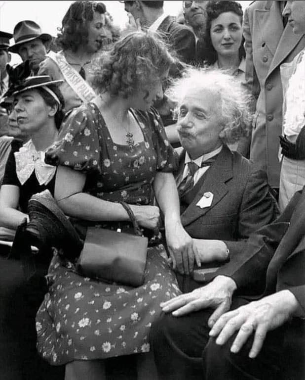

# W03
**181860011 陈彦如**

## task1
主要依靠两个包来实现：
- example.classloader
- example.encoder

### example.encoder
包含三个类：
- DecodingException
- SteganographyEncoder
- SteganographyFactory

##### DecodingException
 继承Exception类，实现解码过程中的异常报错

##### SteganographyEncoder
 实现对于图片的编码和解码的接口  
 实现将指定.class文件编码进图片的字节码的接口

##### SteganographyFactory
 实现将sort.java编码进入图片  
 - **compile()**：调用File和JavaCompiler类，将sort.java编译为sort.class
 - **getSteganography()**：传入sort.java的路径和图片路径，首先调用compile()生成sort.class，再调用steganographyEncoder.encodeFile()将函数隐写进入图片。

### example.classloader
 自定义ClassLoader，实现图片中类的加载  
 主要重写了findClass()函数
```
1    BufferedImage img = ImageIO.read(url);
2    SteganographyEncoder encoder = new SteganographyEncoder(img);
3    byte[] bytes = encoder.decodeByteArray();
4    return this.defineClass(name, bytes, 0, bytes.length);  
```
1：通过url读入图片  
2：通过图片生成SteganographyEncoder对象  
3：解码图片获得sort类的字节码  
4：调用defineClass()，传入字节码，加载sort类

## task2
- InsertionSorter  

        url="https://github.com/jwork-2021/jw03-RudyChan0/blob/main/example.s181860011.code.InsertionSorter.png"  

  

- SelectionSorter  

        url="https://github.com/jwork-2021/jw03-RudyChan0/blob/main/example.s181860011.code.SelectionSorter.png"

  